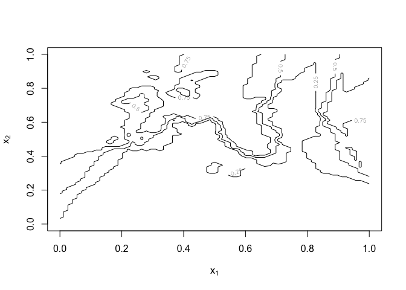
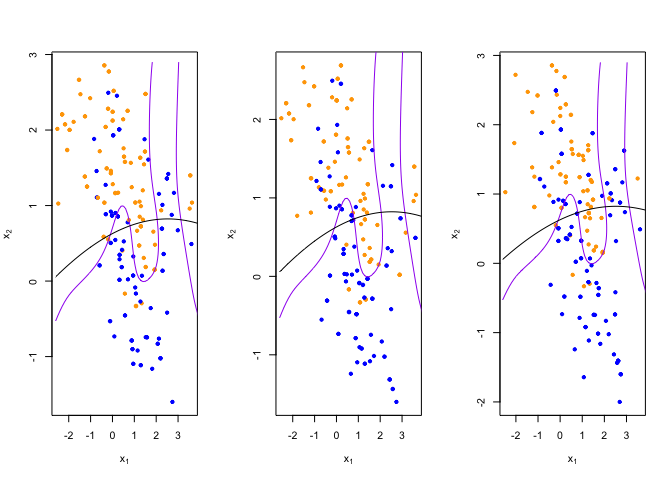
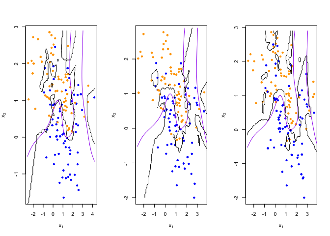
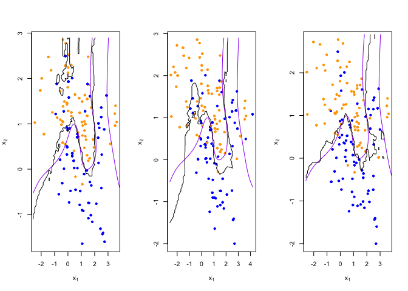

Homework1
================
George Lyu
2023-01-13

## load binary classification example data from author website

## ‘ElemStatLearn’ package no longer available

``` r
load(url('https://web.stanford.edu/~hastie/ElemStatLearn/datasets/ESL.mixture.rda'))
dat <- ESL.mixture

plot_mix_data <- function(dat, datboot=NULL) {
  if(!is.null(datboot)) {
    dat$x <- datboot$x
    dat$y <- datboot$y
  }
  plot(dat$x[,1], dat$x[,2],
       col=ifelse(dat$y==0, 'blue', 'orange'),
       pch=20,
       xlab=expression(x[1]),
       ylab=expression(x[2]))
  ## draw Bayes (True) classification boundary
  prob <- matrix(dat$prob, length(dat$px1), length(dat$px2))
  cont <- contourLines(dat$px1, dat$px2, prob, levels=0.5)
  rslt <- sapply(cont, lines, col='purple')
}

plot_mix_data(dat)
```

<!-- -->

## Changing functions into lm based without adding squared terms

## HW Answer:

As we compare two graphs of the linear regression lines, we could say
that the curved line in the second graph creates a higher variance and
low bias because of the curved line moving towards the yellow area a bit
which causes the accuracy of distinguishing yellow dots to get low and
the variance of points to the line increases.

``` r
dat1<-as.data.frame(cbind(dat$x, dat$y))
colnames(dat1) <- c('x1', 'x2','y')

# Rewrite fit_lc function
fit_lc <- function(y,x){
  lm1 <- lm(y~., data = dat1)
}

predict_lc <- function(xnew, lm2){
  data1 <- as.data.frame(xnew)
  predict.lm(lm2, newdata = data1)
}

lc_beta <- fit_lc(dat1$y, dat1$x)
lc_pred <- predict_lc(dat$xnew, lc_beta)

lc_pred <- matrix(lc_pred, length(dat$px1), length(dat$px2))
contour(lc_pred,
      xlab=expression(x[1]),
      ylab=expression(x[2]))
```

<!-- -->

``` r
lc_cont <- contourLines(dat$px1, dat$px2, lc_pred, levels=0.5)

plot_mix_data(dat)
sapply(lc_cont, lines)
```

<!-- -->

    ## [[1]]
    ## NULL

## Changing functions into lm based with extra squared terms.

## fit linear classifier

## HW ANSWER:

``` r
#fit_lc <- function(y, x) {
#  x <- cbind(1, x)
#  beta <- drop(solve(t(x)%*%x)%*%t(x)%*%y)
#}

dat1<-as.data.frame(cbind(dat$x, dat$y,(dat$x)^2))
colnames(dat1) <- c('x1', 'x2','y','x1^2','x2^2')

# Rewrite fit_lc function
fit_lc <- function(y,x){
  lm1 <- lm(y~., data = dat1)
}
```

## make predictions from linear classifier

## HW ANSWER

``` r
#predict_lc <- function(x, beta) {
#  cbind(1, x) %*% beta
#}
predict_lc <- function(xnew, lm2){
  xnew<-cbind(dat$xnew, (dat$xnew)^2)
  data1 <- as.data.frame(xnew)
  colnames(data1)<-c('x1','x2','x1^2','x2^2')
  predict.lm(lm2, newdata = data1)
}
```

## fit model to mixture data and make predictions

``` r
lc_beta <- fit_lc(dat1$y, dat1$x)
lc_pred <- predict_lc(dat$xnew, lc_beta)
```

## reshape predictions as a matrix

``` r
lc_pred <- matrix(lc_pred, length(dat$px1), length(dat$px2))
contour(lc_pred,
      xlab=expression(x[1]),
      ylab=expression(x[2]))
```

<!-- -->

## find the contours in 2D space such that lc_pred == 0.5

``` r
lc_cont <- contourLines(dat$px1, dat$px2, lc_pred, levels=0.5)
```

## plot data and decision surface for added x1 square and x2 square terms

``` r
plot_mix_data(dat)
sapply(lc_cont, lines)
```

<!-- -->

    ## [[1]]
    ## NULL

``` r
## fit knn classifier
## use 5-NN to estimate probability of class assignment
knn_fit <- knn(train=dat$x, test=dat$xnew, cl=dat$y, k=5, prob=TRUE)
knn_pred <- attr(knn_fit, 'prob')
knn_pred <- ifelse(knn_fit == 1, knn_pred, 1-knn_pred)

## reshape predictions as a matrix
knn_pred <- matrix(knn_pred, length(dat$px1), length(dat$px2))
contour(knn_pred,
        xlab=expression(x[1]),
        ylab=expression(x[2]),
        levels=c(0.25, 0.5, 0.75))
```

<!-- -->

``` r
## find the contours in 2D space such that knn_pred == 0.5
knn_cont <- contourLines(dat$px1, dat$px2, knn_pred, levels=0.5)

## plot data and decision surface
plot_mix_data(dat)
sapply(knn_cont, lines)
```

<!-- -->

    ## [[1]]
    ## NULL
    ## 
    ## [[2]]
    ## NULL
    ## 
    ## [[3]]
    ## NULL
    ## 
    ## [[4]]
    ## NULL
    ## 
    ## [[5]]
    ## NULL

``` r
## do bootstrap to get a sense of variance in decision surface
resample <- function(dat) {
  idx <- sample(1:length(dat$y), replace = T)
  dat$y <- dat$y[idx]
  dat$x <- dat$x[idx,]
  return(dat)
}
  
## plot linear classifier for three bootstraps
par(mfrow=c(1,3))
for(b in 1:3) {
  datb <- resample(dat)
  ## fit model to mixture data and make predictions
  lc_beta <- fit_lc(datb$y, datb$x)
  lc_pred <- predict_lc(datb$xnew, lc_beta)
  
  ## reshape predictions as a matrix
  lc_pred <- matrix(lc_pred, length(datb$px1), length(datb$px2))

  ## find the contours in 2D space such that lc_pred == 0.5
  lc_cont <- contourLines(datb$px1, datb$px2, lc_pred, levels=0.5)
  
  ## plot data and decision surface
  plot_mix_data(dat, datb)
  sapply(lc_cont, lines)
}
```

<!-- -->

``` r
## plot 5-NN classifier for three bootstraps
par(mfrow=c(1,3))
for(b in 1:3) {
  datb <- resample(dat)
  
  knn_fit <- knn(train=datb$x, test=datb$xnew, cl=datb$y, k=5, prob=TRUE)
  knn_pred <- attr(knn_fit, 'prob')
  knn_pred <- ifelse(knn_fit == 1, knn_pred, 1-knn_pred)
  
  ## reshape predictions as a matrix
  knn_pred <- matrix(knn_pred, length(datb$px1), length(datb$px2))

  ## find the contours in 2D space such that knn_pred == 0.5
  knn_cont <- contourLines(datb$px1, datb$px2, knn_pred, levels=0.5)
  
  ## plot data and decision surface
  plot_mix_data(dat, datb)
  sapply(knn_cont, lines)
}
```

<!-- -->

``` r
## plot 20-NN classifier for three bootstraps
par(mfrow=c(1,3))
for(b in 1:3) {
  datb <- resample(dat)
  
  knn_fit <- knn(train=datb$x, test=datb$xnew, cl=datb$y, k=20, prob=TRUE)
  knn_pred <- attr(knn_fit, 'prob')
  knn_pred <- ifelse(knn_fit == 1, knn_pred, 1-knn_pred)
  
  ## reshape predictions as a matrix
  knn_pred <- matrix(knn_pred, length(datb$px1), length(datb$px2))
  
  ## find the contours in 2D space such that knn_pred == 0.5
  knn_cont <- contourLines(datb$px1, datb$px2, knn_pred, levels=0.5)
  
  ## plot data and decision surface
  plot_mix_data(dat, datb)
  sapply(knn_cont, lines)
}
```

<!-- -->
