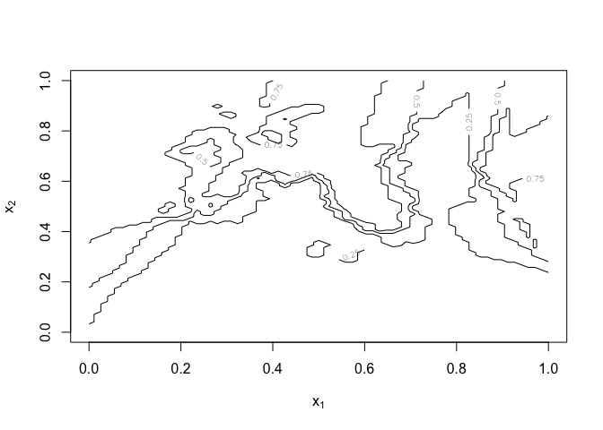
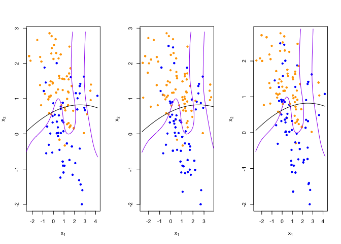
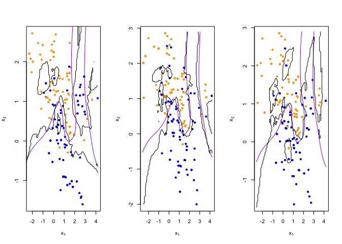
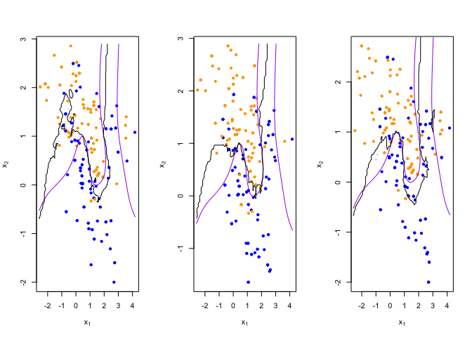

Homework1
================
George Lyu
2023-01-13

## load binary classification example data from author website

## ‘ElemStatLearn’ package no longer available

``` r
load(url('https://web.stanford.edu/~hastie/ElemStatLearn/datasets/ESL.mixture.rda'))
dat <- ESL.mixture

plot_mix_data <- function(dat, datboot=NULL) {
  if(!is.null(datboot)) {
    dat$x <- datboot$x
    dat$y <- datboot$y
  }
  plot(dat$x[,1], dat$x[,2],
       col=ifelse(dat$y==0, 'blue', 'orange'),
       pch=20,
       xlab=expression(x[1]),
       ylab=expression(x[2]))
  ## draw Bayes (True) classification boundary
  prob <- matrix(dat$prob, length(dat$px1), length(dat$px2))
  cont <- contourLines(dat$px1, dat$px2, prob, levels=0.5)
  rslt <- sapply(cont, lines, col='purple')
}

plot_mix_data(dat)
```

<!-- -->

## Changing functions into lm based without adding squared terms

## HW Answer:

``` r
dat1<-as.data.frame(cbind(dat$x, dat$y))
colnames(dat1) <- c('x1', 'x2','y')

# Rewrite fit_lc function
fit_lc <- function(y,x){
  lm1 <- lm(y~., data = dat1)
}

predict_lc <- function(xnew, lm2){
  data1 <- as.data.frame(xnew)
  predict.lm(lm2, newdata = data1)
}

lc_beta <- fit_lc(dat1$y, dat1$x)
lc_pred <- predict_lc(dat$xnew, lc_beta)

lc_pred <- matrix(lc_pred, length(dat$px1), length(dat$px2))
contour(lc_pred,
      xlab=expression(x[1]),
      ylab=expression(x[2]))
```

<!-- -->

``` r
lc_cont <- contourLines(dat$px1, dat$px2, lc_pred, levels=0.5)

plot_mix_data(dat)
sapply(lc_cont, lines)
```

<!-- -->

    ## [[1]]
    ## NULL

## Changing functions into lm based with extra squared terms.

## fit linear classifier

## HW ANSWER:

``` r
#fit_lc <- function(y, x) {
#  x <- cbind(1, x)
#  beta <- drop(solve(t(x)%*%x)%*%t(x)%*%y)
#}

dat1<-as.data.frame(cbind(dat$x, dat$y,(dat$x)^2))
colnames(dat1) <- c('x1', 'x2','y','x1^2','x2^2')

# Rewrite fit_lc function
fit_lc <- function(y,x){
  lm1 <- lm(y~., data = dat1)
}
```

## make predictions from linear classifier

## HW ANSWER

``` r
#predict_lc <- function(x, beta) {
#  cbind(1, x) %*% beta
#}
predict_lc <- function(xnew, lm2){
  xnew<-cbind(dat$xnew, (dat$xnew)^2)
  data1 <- as.data.frame(xnew)
  colnames(data1)<-c('x1','x2','x1^2','x2^2')
  predict.lm(lm2, newdata = data1)
}
```

## fit model to mixture data and make predictions

``` r
lc_beta <- fit_lc(dat1$y, dat1$x)
lc_pred <- predict_lc(dat$xnew, lc_beta)
```

## reshape predictions as a matrix

``` r
lc_pred <- matrix(lc_pred, length(dat$px1), length(dat$px2))
contour(lc_pred,
      xlab=expression(x[1]),
      ylab=expression(x[2]))
```

<!-- -->

## find the contours in 2D space such that lc_pred == 0.5

``` r
lc_cont <- contourLines(dat$px1, dat$px2, lc_pred, levels=0.5)
```

## plot data and decision surface for added x1 square and x2 square terms

``` r
plot_mix_data(dat)
sapply(lc_cont, lines)
```

<!-- -->

    ## [[1]]
    ## NULL

``` r
## fit knn classifier
## use 5-NN to estimate probability of class assignment
knn_fit <- knn(train=dat$x, test=dat$xnew, cl=dat$y, k=5, prob=TRUE)
knn_pred <- attr(knn_fit, 'prob')
knn_pred <- ifelse(knn_fit == 1, knn_pred, 1-knn_pred)

## reshape predictions as a matrix
knn_pred <- matrix(knn_pred, length(dat$px1), length(dat$px2))
contour(knn_pred,
        xlab=expression(x[1]),
        ylab=expression(x[2]),
        levels=c(0.25, 0.5, 0.75))
```

<!-- -->

``` r
## find the contours in 2D space such that knn_pred == 0.5
knn_cont <- contourLines(dat$px1, dat$px2, knn_pred, levels=0.5)

## plot data and decision surface
plot_mix_data(dat)
sapply(knn_cont, lines)
```

<!-- -->

    ## [[1]]
    ## NULL
    ## 
    ## [[2]]
    ## NULL
    ## 
    ## [[3]]
    ## NULL
    ## 
    ## [[4]]
    ## NULL
    ## 
    ## [[5]]
    ## NULL

``` r
## do bootstrap to get a sense of variance in decision surface
resample <- function(dat) {
  idx <- sample(1:length(dat$y), replace = T)
  dat$y <- dat$y[idx]
  dat$x <- dat$x[idx,]
  return(dat)
}
  
## plot linear classifier for three bootstraps
par(mfrow=c(1,3))
for(b in 1:3) {
  datb <- resample(dat)
  ## fit model to mixture data and make predictions
  lc_beta <- fit_lc(datb$y, datb$x)
  lc_pred <- predict_lc(datb$xnew, lc_beta)
  
  ## reshape predictions as a matrix
  lc_pred <- matrix(lc_pred, length(datb$px1), length(datb$px2))

  ## find the contours in 2D space such that lc_pred == 0.5
  lc_cont <- contourLines(datb$px1, datb$px2, lc_pred, levels=0.5)
  
  ## plot data and decision surface
  plot_mix_data(dat, datb)
  sapply(lc_cont, lines)
}
```

<!-- -->

``` r
## plot 5-NN classifier for three bootstraps
par(mfrow=c(1,3))
for(b in 1:3) {
  datb <- resample(dat)
  
  knn_fit <- knn(train=datb$x, test=datb$xnew, cl=datb$y, k=5, prob=TRUE)
  knn_pred <- attr(knn_fit, 'prob')
  knn_pred <- ifelse(knn_fit == 1, knn_pred, 1-knn_pred)
  
  ## reshape predictions as a matrix
  knn_pred <- matrix(knn_pred, length(datb$px1), length(datb$px2))

  ## find the contours in 2D space such that knn_pred == 0.5
  knn_cont <- contourLines(datb$px1, datb$px2, knn_pred, levels=0.5)
  
  ## plot data and decision surface
  plot_mix_data(dat, datb)
  sapply(knn_cont, lines)
}
```

<!-- -->

``` r
## plot 20-NN classifier for three bootstraps
par(mfrow=c(1,3))
for(b in 1:3) {
  datb <- resample(dat)
  
  knn_fit <- knn(train=datb$x, test=datb$xnew, cl=datb$y, k=20, prob=TRUE)
  knn_pred <- attr(knn_fit, 'prob')
  knn_pred <- ifelse(knn_fit == 1, knn_pred, 1-knn_pred)
  
  ## reshape predictions as a matrix
  knn_pred <- matrix(knn_pred, length(datb$px1), length(datb$px2))
  
  ## find the contours in 2D space such that knn_pred == 0.5
  knn_cont <- contourLines(datb$px1, datb$px2, knn_pred, levels=0.5)
  
  ## plot data and decision surface
  plot_mix_data(dat, datb)
  sapply(knn_cont, lines)
}
```

<!-- -->

## Bias - Variance Tradeoff

By adding x-squared terms into the model, I added more flexibility into
the fitting curve. This more flexible model increases bias as this
curved model potentially increase deviation between true value and
average of the prediction values. On the other hand, according to the
bias-variance tradeoff, the increasing bias will have a decreasing in
variance. Therefore, this model with extra squared terms causes lower
variance and higher bias.
