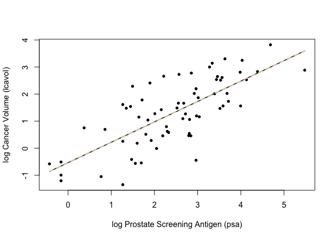
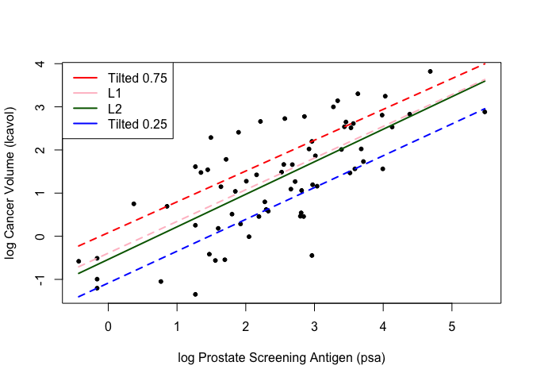
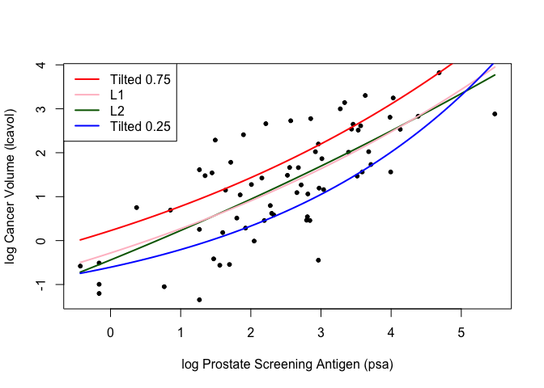

Homework2
================
George Lyu
2023-01-22

``` r
## load prostate data
prostate <- 
  read.table(url(
    'https://web.stanford.edu/~hastie/ElemStatLearn/datasets/prostate.data'))

## subset to training examples
prostate_train <- subset(prostate, train==TRUE)

## plot lcavol vs lpsa
plot_psa_data <- function(dat=prostate_train) {
  plot(dat$lpsa, dat$lcavol,
       xlab="log Prostate Screening Antigen (psa)",
       ylab="log Cancer Volume (lcavol)",
       pch = 20)
}
plot_psa_data()

############################
## regular linear regression
############################

## L2 loss function
L2_loss <- function(y, yhat)
  (y-yhat)^2

## fit simple linear model using numerical optimization
fit_lin <- function(y, x, loss=L2_loss, beta_init = c(-0.51, 0.75)) {
  err <- function(beta)
    mean(loss(y,  beta[1] + beta[2]*x))
  beta <- optim(par = beta_init, fn = err)
  return(beta)
}

## make predictions from linear model
predict_lin <- function(x, beta)
  beta[1] + beta[2]*x

## fit linear model
lin_beta <- fit_lin(y=prostate_train$lcavol,
                    x=prostate_train$lpsa,
                    loss=L2_loss)

## compute predictions for a grid of inputs
x_grid <- seq(min(prostate_train$lpsa),
              max(prostate_train$lpsa),
              length.out=100)
lin_pred <- predict_lin(x=x_grid, beta=lin_beta$par)

## plot data
plot_psa_data()

## plot predictions
lines(x=x_grid, y=lin_pred, col='darkgreen', lwd=2)

## do the same thing with 'lm'
lin_fit_lm <- lm(lcavol ~ lpsa, data=prostate_train)

## make predictins using 'lm' object
lin_pred_lm <- predict(lin_fit_lm, data.frame(lpsa=x_grid))

## plot predictions from 'lm'
lines(x=x_grid, y=lin_pred_lm, col='pink', lty=2, lwd=2)
```

<!-- -->

``` r
##################################
## try modifying the loss function
##################################

## custom loss function
custom_loss <- function(y, yhat)
  qrnn::tilted.abs(y-yhat, tau = 0.25)

## plot custom loss function
err_grd <- seq(-1,1,length.out=200)
plot(err_grd, custom_loss(err_grd,0), type='l',
     xlab='y-yhat', ylab='custom loss')
```

<!-- -->

``` r
## fit linear model with custom loss
lin_beta_custom <- fit_lin(y=prostate_train$lcavol,
                    x=prostate_train$lpsa,
                    loss=custom_loss)

lin_pred_custom <- predict_lin(x=x_grid, beta=lin_beta_custom$par)

## plot data
plot_psa_data()

## plot predictions from L2 loss
lines(x=x_grid, y=lin_pred, col='darkgreen', lwd=2)

## plot predictions from custom loss
lines(x=x_grid, y=lin_pred_custom, col='pink', lwd=2, lty=2)
```

<!-- -->

## Homework code

### 1. Write functions for L1 loss and tilted absolute loss functions

``` r
# L1 loss function
L1_loss <- function(y, yhat){
  return (abs(y-yhat))
}

# Tilted absolute loss
tilted <- function(y, yhat, tau){
  ifelse(y-yhat>0,tau*(y-yhat),(tau-1)*(y-yhat))
}

# Fitting Tilted Absolute Loss Function
fit_lin_tilted <- function(y, x, loss=tilted, beta_init = c(-0.51, 0.75), tau = 0.25) {
  err <- function(beta)
    mean(loss(y,  beta[1] + beta[2]*x, tau))
  beta <- optim(par = beta_init, fn = err)
  return(beta)
}
```

### 2. Create a figure comparing linear models

Plotting L1

``` r
## fit linear model with L1 loss
lin_beta_l1 <- fit_lin(y=prostate_train$lcavol,
                    x=prostate_train$lpsa,
                    loss=L1_loss)

lin_pred_l1 <- predict_lin(x=x_grid, beta=lin_beta_l1$par)
```

Plotting Tilted Loss Function

``` r
## fit linear model with tilted loss with tau = 0.25
lin_beta_tilted_0.25 <- fit_lin_tilted(y=prostate_train$lcavol,
                    x=prostate_train$lpsa,
                    loss=tilted, tau = 0.25)

lin_pred_tilted_0.25 <- predict_lin(x=x_grid, beta=lin_beta_tilted_0.25$par)


## fit linear model with tilted loss with tau = 0.75
lin_beta_tilted_0.75 <- fit_lin_tilted(y=prostate_train$lcavol,
                    x=prostate_train$lpsa,
                    loss=tilted, tau = 0.75)

lin_pred_tilted_0.75 <- predict_lin(x=x_grid, beta=lin_beta_tilted_0.75$par)
```

``` r
## plot data
plot_psa_data()

## plot predictions from L2 loss
lines(x=x_grid, y=lin_pred, col='darkgreen', lwd=2)

## plot predictions from l1 loss
lines(x=x_grid, y=lin_pred_l1, col='pink', lwd=2, lty=2)

## plot predictions from tilted loss with 0.25
lines(x=x_grid, y=lin_pred_tilted_0.25, col='blue', lwd=2, lty=2)

## plot predictions from tilted loss with 0.75
lines(x=x_grid, y=lin_pred_tilted_0.75, col='red', lwd=2, lty=2)

legend(x="topleft", legend=c("Tilted 0.75","L1","L2","Tilted 0.25"), lwd = c(2,2,2,2), col =  c("red","pink","darkgreen","blue"))
```

<!-- -->

### 3. Write functions to fit and predict nonlinear model

``` r
## fit non-linear model using numerical optimization
fit_nonlin <- function(y, x, loss=L2_loss, beta_init = c(-1, 0.0, -0.3)) {
  err <- function(beta)
    mean(loss(y,  beta[1] + beta[2]*exp(-beta[3]*x)))
  beta <- optim(par = beta_init, fn = err)
  return(beta)
}

## make predictions from linear model
predict_nonlin <- function(x, beta)
  beta[1] + beta[2]*exp(-beta[3]*x)

## fit tilted absolute loss function

fit_nonlin_tilted <- function(y, x, loss=tilted, beta_init = c(-1, 0.0, -0.3), tau = 0.25) {
  err <- function(beta)
    mean(loss(y,  beta[1] + beta[2]*exp(-beta[3]*x), tau))
  beta <- optim(par = beta_init, fn = err)
  return(beta)
}
```

``` r
# plotting l1 nonlinear
lin_beta_nonl1 <- fit_nonlin(y=prostate_train$lcavol,
                    x=prostate_train$lpsa,
                    loss=L1_loss)

lin_pred_nonl1 <- predict_nonlin(x=x_grid, beta=lin_beta_nonl1$par)


# plotting l2 nonlinear
lin_beta_nonl2 <- fit_nonlin(y=prostate_train$lcavol,
                    x=prostate_train$lpsa,
                    loss=L2_loss)

lin_pred_nonl2 <- predict_nonlin(x=x_grid, beta=lin_beta_nonl2$par)

# plotting tilted absolute loss with tau=0.25
lin_beta_nontilted_0.25 <- fit_nonlin_tilted(y=prostate_train$lcavol,
                    x=prostate_train$lpsa,
                    loss=tilted, tau = 0.25)

lin_pred_nontilted_0.25 <- predict_nonlin(x=x_grid, beta=lin_beta_nontilted_0.25$par)

# plotting tilted absolute loss with tau=0.75
lin_beta_nontilted_0.75 <- fit_nonlin_tilted(y=prostate_train$lcavol,
                    x=prostate_train$lpsa,
                    loss=tilted, tau = 0.75)

lin_pred_nontilted_0.75 <- predict_nonlin(x=x_grid, beta=lin_beta_nontilted_0.75$par)

## plot data
plot_psa_data()

## plot predictions from L2 loss
lines(x=x_grid, y=lin_pred_nonl2, col='darkgreen', lwd=2)

## plot predictions from l1 loss
lines(x=x_grid, y=lin_pred_nonl1, col='pink', lwd=2)

## plot predictions from tilted loss with 0.25
lines(x=x_grid, y=lin_pred_nontilted_0.25, col='blue', lwd=2)

## plot predictions from tilted loss with 0.75
lines(x=x_grid, y=lin_pred_nontilted_0.75, col='red', lwd=2)

legend(x="topleft", legend=c("Tilted 0.75","L1","L2","Tilted 0.25"), lwd = c(2,2,2,2), col =  c("red","pink","darkgreen","blue"))
```

<!-- -->
