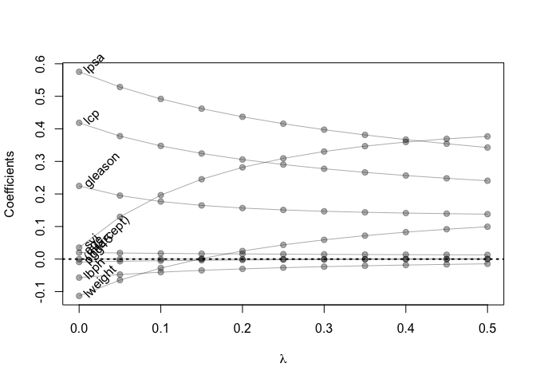

Homework3
================
George Lyu
2023-02-09

``` r
library('splines')        ## for 'bs'
library('dplyr')          ## for 'select', 'filter', and others
```

    ## 
    ## Attaching package: 'dplyr'

    ## The following objects are masked from 'package:stats':
    ## 
    ##     filter, lag

    ## The following objects are masked from 'package:base':
    ## 
    ##     intersect, setdiff, setequal, union

``` r
library('magrittr')       ## for '%<>%' operator
library('glmnet')         ## for 'glmnet'
```

    ## Loading required package: Matrix

    ## Loaded glmnet 4.1-3

``` r
## load prostate data
prostate <- 
  read.table(url(
    'https://web.stanford.edu/~hastie/ElemStatLearn/datasets/prostate.data'))
```

1.  Using the correlation function reproduce the correlation matrix

``` r
cor(prostate)
```

    ##              lcavol      lweight       age         lbph         svi
    ## lcavol   1.00000000  0.280521380 0.2249999  0.027349703  0.53884500
    ## lweight  0.28052138  1.000000000 0.3479691  0.442264399  0.15538490
    ## age      0.22499988  0.347969112 1.0000000  0.350185896  0.11765804
    ## lbph     0.02734970  0.442264399 0.3501859  1.000000000 -0.08584324
    ## svi      0.53884500  0.155384903 0.1176580 -0.085843238  1.00000000
    ## lcp      0.67531048  0.164537142 0.1276678 -0.006999431  0.67311118
    ## gleason  0.43241706  0.056882093 0.2688916  0.077820447  0.32041222
    ## pgg45    0.43365225  0.107353785 0.2761124  0.078460018  0.45764762
    ## lpsa     0.73446033  0.433319382 0.1695928  0.179809404  0.56621822
    ## train   -0.04654347 -0.009940658 0.1776155 -0.029939957  0.02679950
    ##                  lcp     gleason      pgg45        lpsa        train
    ## lcavol   0.675310484  0.43241706 0.43365225  0.73446033 -0.046543468
    ## lweight  0.164537142  0.05688209 0.10735379  0.43331938 -0.009940658
    ## age      0.127667752  0.26889160 0.27611245  0.16959284  0.177615517
    ## lbph    -0.006999431  0.07782045 0.07846002  0.17980940 -0.029939957
    ## svi      0.673111185  0.32041222 0.45764762  0.56621822  0.026799505
    ## lcp      1.000000000  0.51483006 0.63152825  0.54881317 -0.037427296
    ## gleason  0.514830063  1.00000000 0.75190451  0.36898681 -0.044171456
    ## pgg45    0.631528246  0.75190451 1.00000000  0.42231586  0.100516371
    ## lpsa     0.548813175  0.36898681 0.42231586  1.00000000 -0.033889743
    ## train   -0.037427296 -0.04417146 0.10051637 -0.03388974  1.000000000

2.  Train a least square regression model

``` r
prostate_train_2 <- prostate %>% filter(train == TRUE) %>% select(-train)
lm(lcavol ~ ., prostate_train_2)
```

    ## 
    ## Call:
    ## lm(formula = lcavol ~ ., data = prostate_train_2)
    ## 
    ## Coefficients:
    ## (Intercept)      lweight          age         lbph          svi          lcp  
    ##   -2.173357    -0.113370     0.020102    -0.056981     0.035116     0.418455  
    ##     gleason        pgg45         lpsa  
    ##    0.224387    -0.009113     0.575455

``` r
fit<-lm(lcavol ~ ., prostate_train_2)
```

3.  Compute the average squared test error

``` r
prostate_test_2<- prostate %>% filter(train == FALSE) %>% select(-train)
show(prostate_test_2)
```

    ##          lcavol  lweight age       lbph svi         lcp gleason pgg45      lpsa
    ## 7   0.737164066 3.473518  64  0.6151856   0 -1.38629436       6     0 0.7654678
    ## 9  -0.776528789 3.539509  47 -1.3862944   0 -1.38629436       6     0 1.0473190
    ## 10  0.223143551 3.244544  63 -1.3862944   0 -1.38629436       6     0 1.0473190
    ## 15  1.205970807 3.442019  57 -1.3862944   0 -0.43078292       7     5 1.3987169
    ## 22  2.059238834 3.501043  60  1.4747630   0  1.34807315       7    20 1.6582281
    ## 25  0.385262401 3.667400  69  1.5993876   0 -1.38629436       6     0 1.7316555
    ## 26  1.446918983 3.124565  68  0.3001046   0 -1.38629436       6     0 1.7664417
    ## 28 -0.400477567 3.865979  67  1.8164521   0 -1.38629436       7    20 1.8164521
    ## 32  0.182321557 3.804438  65  1.7047481   0 -1.38629436       6     0 2.0082140
    ## 34  0.009950331 3.267666  54 -1.3862944   0 -1.38629436       6     0 2.0215476
    ## 36  1.308332820 4.119850  64  2.1713368   0 -1.38629436       7     5 2.0856721
    ## 42  1.442201993 3.682610  68 -1.3862944   0 -1.38629436       7    10 2.3075726
    ## 44  1.771556762 3.896909  61 -1.3862944   0  0.81093022       7     6 2.3749058
    ## 48  1.163150810 4.035125  68  1.7137979   0 -0.43078292       7    40 2.5687881
    ## 49  1.745715531 3.498022  43 -1.3862944   0 -1.38629436       6     0 2.5915164
    ## 50  1.220829921 3.568123  70  1.3737156   0 -0.79850770       6     0 2.5915164
    ## 53  0.512823626 3.633631  64  1.4929041   0  0.04879016       7    70 2.6844403
    ## 54  2.127040520 4.121473  68  1.7664417   0  1.44691898       7    40 2.6912431
    ## 55  3.153590358 3.516013  59 -1.3862944   0 -1.38629436       7     5 2.7047113
    ## 57  0.974559640 2.865054  47 -1.3862944   0  0.50077529       7     4 2.7880929
    ## 62  1.997417706 3.719651  63  1.6193882   1  1.90954250       7    40 2.8535925
    ## 64  2.034705648 3.917011  66  2.0082140   1  2.11021320       7    60 2.8820035
    ## 65  2.073171929 3.623007  64 -1.3862944   0 -1.38629436       6     0 2.8820035
    ## 66  1.458615023 3.836221  61  1.3217558   0 -0.43078292       7    20 2.8875901
    ## 73  1.214912744 3.825375  69 -1.3862944   1  0.22314355       7    20 3.0563569
    ## 74  1.838961071 3.236716  60  0.4382549   1  1.17865500       9    90 3.0750055
    ## 80  2.779440197 3.823192  63 -1.3862944   0  0.37156356       7    50 3.5130369
    ## 84  2.677590994 3.838376  65  1.1151416   0  1.74919985       9    70 3.5709402
    ## 95  2.907447359 3.396185  52 -1.3862944   1  2.46385324       7    10 5.1431245
    ## 97  3.471966453 3.974998  68  0.4382549   1  2.90416508       7    20 5.5829322

``` r
#function to get the squared-error loss
loss2 <- function(y, yhat){
  (y-yhat)^2
}

#function to get the test error
test_error <- function(data, fit, loss = loss2){
  mean(loss(data$lcavol, predict(fit, newdata = data)))
}

test_error(prostate_test_2, fit)
```

    ## [1] 0.5084068

4.  Train a ridge regression model and test on lambda to minimize test
    error

ANS: As we compare all the error with different lambda values, the
lowerst error is when lambda is roughly around 0.1.

``` r
## use glmnet to fit ridge
## glmnet fits using penalized L2 loss
## first create an input matrix and output vector
form  <- lcavol ~  lweight + age + lbph + lcp + pgg45 + lpsa + svi + gleason
x_inp <- model.matrix(form, data=prostate_train_2)
y_out <- prostate_train_2$lcavol
fit <- glmnet(x=x_inp, y=y_out, lambda=seq(0.5, 0, -0.05), alpha = 0)
print(fit$beta)
```

    ## 9 x 11 sparse Matrix of class "dgCMatrix"

    ##    [[ suppressing 11 column names 's0', 's1', 's2' ... ]]

    ##                                                                    
    ## (Intercept)  .             .             .             .           
    ## lweight      0.0993164708  9.167566e-02  0.0826683948  0.0719539791
    ## age          0.0129153943  1.324527e-02  0.0136179441  0.0140406458
    ## lbph        -0.0145798645 -1.634009e-02 -0.0183250211 -0.0206075810
    ## lcp          0.2406189663  2.481045e-01  0.2566365965  0.2662889674
    ## pgg45        0.0002559092 -6.282802e-05 -0.0004352183 -0.0008738898
    ## lpsa         0.3427088262  3.542773e-01  0.3670625828  0.3813402190
    ## svi          0.3767521726  3.693591e-01  0.3595330020  0.3468674180
    ## gleason      0.1379543516  1.394770e-01  0.1413173561  0.1436779615
    ##                                                                             
    ## (Intercept)  .            .            .            .            .          
    ## lweight      0.059127616  0.043652593  0.024777969  0.001504802 -0.027603986
    ## age          0.014526957  0.015088490  0.015748487  0.016532948  0.017480107
    ## lbph        -0.023258103 -0.026377963 -0.030098852 -0.034621150 -0.040241264
    ## lcp          0.277447149  0.290342311  0.305728439  0.324372008  0.347616547
    ## pgg45       -0.001398912 -0.002031353 -0.002810371 -0.003788173 -0.005050263
    ## lpsa         0.397429712  0.415786556  0.437009864  0.461951799  0.491849702
    ## svi          0.330415198  0.309283880  0.281608260  0.245177911  0.196427346
    ## gleason      0.146778188  0.150949425  0.156678907  0.164800413  0.176722769
    ##                                      
    ## (Intercept)  .            .          
    ## lweight     -0.064680201 -0.113137304
    ## age          0.018643148  0.020098181
    ## lbph        -0.047425776 -0.056962692
    ## lcp          0.377657417  0.418431830
    ## pgg45       -0.006739814 -0.009116838
    ## lpsa         0.528596455  0.575318051
    ## svi          0.129711598  0.035342349
    ## gleason      0.194999807  0.224585243

``` r
## functions to compute testing/training error with glmnet
error <- function(dat, fit, lam, form, loss=loss2) {
  x_inp <- model.matrix(form, data=dat)
  y_out <- dat$lcavol
  y_hat <- predict(fit, newx=x_inp, s=lam)  ## see predict.elnet
  mean(loss(y_out, y_hat))
}

## train_error at lambda=0
error(prostate_train_2, fit, lam=0, form=form)
```

    ## [1] 0.4383709

``` r
## testing error at lambda=0
error(prostate_test_2, fit, lam=0, form=form)
```

    ## [1] 0.5083923

``` r
## train_error at lambda=0.03
error(prostate_train_2, fit, lam=0.03, form=form)
```

    ## [1] 0.4395821

``` r
## testing error at lambda=0.03
error(prostate_test_2, fit, lam=0.03, form=form)
```

    ## [1] 0.498955

``` r
## train_error at lambda=0.05
error(prostate_train_2, fit, lam=0.05, form=form)
```

    ## [1] 0.4417309

``` r
## testing error at lambda=0.05
error(prostate_test_2, fit, lam=0.05, form=form)
```

    ## [1] 0.4950521

``` r
## train_error at lambda=0.1
error(prostate_train_2, fit, lam=0.1, form=form)
```

    ## [1] 0.4486907

``` r
## testing error at lambda=0.1
error(prostate_test_2, fit, lam=0.1, form=form)
```

    ## [1] 0.4914336

5.  Figure shows the train and test error

``` r
## compute training and testing errors as function of lambda
err_train_1 <- sapply(fit$lambda, function(lam) 
  error(prostate_train_2, fit, lam, form))
err_test_1 <- sapply(fit$lambda, function(lam) 
  error(prostate_test_2, fit, lam, form))

## plot test/train error
plot(x=range(fit$lambda),
     y=range(c(err_train_1, err_test_1)),
     xlim=rev(range(fit$lambda)),
     type='n',
     xlab=expression(lambda),
     ylab='train/test error')
points(fit$lambda, err_train_1, pch=19, type='b', col='darkblue')
points(fit$lambda, err_test_1, pch=19, type='b', col='darkred')
legend('topright', c('train','test'), lty=1, pch=19,
       col=c('darkblue','darkred'), bty='n')
```

<!-- -->

``` r
colnames(fit$beta) <- paste('lam =', fit$lambda)
print(fit$beta %>% as.matrix)
```

    ##                 lam = 0.5    lam = 0.45     lam = 0.4    lam = 0.35
    ## (Intercept)  0.0000000000  0.000000e+00  0.0000000000  0.0000000000
    ## lweight      0.0993164708  9.167566e-02  0.0826683948  0.0719539791
    ## age          0.0129153943  1.324527e-02  0.0136179441  0.0140406458
    ## lbph        -0.0145798645 -1.634009e-02 -0.0183250211 -0.0206075810
    ## lcp          0.2406189663  2.481045e-01  0.2566365965  0.2662889674
    ## pgg45        0.0002559092 -6.282802e-05 -0.0004352183 -0.0008738898
    ## lpsa         0.3427088262  3.542773e-01  0.3670625828  0.3813402190
    ## svi          0.3767521726  3.693591e-01  0.3595330020  0.3468674180
    ## gleason      0.1379543516  1.394770e-01  0.1413173561  0.1436779615
    ##                lam = 0.3   lam = 0.25    lam = 0.2   lam = 0.15    lam = 0.1
    ## (Intercept)  0.000000000  0.000000000  0.000000000  0.000000000  0.000000000
    ## lweight      0.059127616  0.043652593  0.024777969  0.001504802 -0.027603986
    ## age          0.014526957  0.015088490  0.015748487  0.016532948  0.017480107
    ## lbph        -0.023258103 -0.026377963 -0.030098852 -0.034621150 -0.040241264
    ## lcp          0.277447149  0.290342311  0.305728439  0.324372008  0.347616547
    ## pgg45       -0.001398912 -0.002031353 -0.002810371 -0.003788173 -0.005050263
    ## lpsa         0.397429712  0.415786556  0.437009864  0.461951799  0.491849702
    ## svi          0.330415198  0.309283880  0.281608260  0.245177911  0.196427346
    ## gleason      0.146778188  0.150949425  0.156678907  0.164800413  0.176722769
    ##               lam = 0.05      lam = 0
    ## (Intercept)  0.000000000  0.000000000
    ## lweight     -0.064680201 -0.113137304
    ## age          0.018643148  0.020098181
    ## lbph        -0.047425776 -0.056962692
    ## lcp          0.377657417  0.418431830
    ## pgg45       -0.006739814 -0.009116838
    ## lpsa         0.528596455  0.575318051
    ## svi          0.129711598  0.035342349
    ## gleason      0.194999807  0.224585243

6.  Create a path diagram for ridge regression analysis

``` r
## plot path diagram
plot(x=range(fit$lambda),
     y=range(as.matrix(fit$beta)),
     type='n',
     xlab=expression(lambda),
     ylab='Coefficients')
for(i in 1:nrow(fit$beta)) {
  points(x=fit$lambda, y=fit$beta[i,], pch=19, col='#00000055')
  lines(x=fit$lambda, y=fit$beta[i,], col='#00000055')
}
text(x=0, y=fit$beta[,ncol(fit$beta)], 
     labels=rownames(fit$beta),
     xpd=NA, pos=4, srt=45)
abline(h=0, lty=3, lwd=2)
```

<!-- -->
