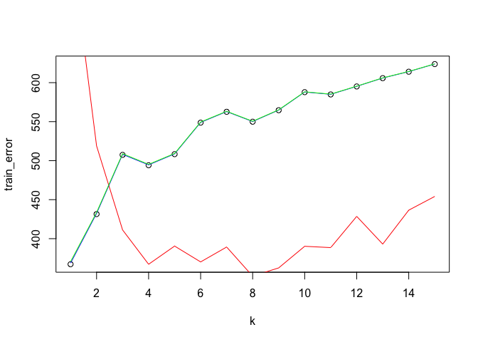
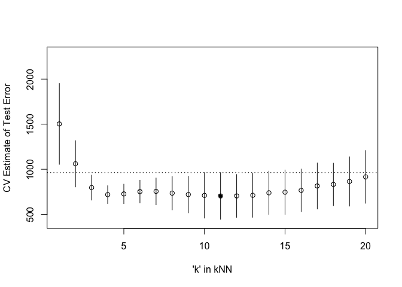

Homework4
================
George Lyu
2023-02-23

### 1. Randomly split data into 75% and 25% for training and testing data

``` r
library('MASS') ## for 'mcycle'
library('manipulate') ## for 'manipulate'
library("caret")
```

    ## Loading required package: ggplot2

    ## Loading required package: lattice

``` r
set.seed(123)

df <- mcycle
sample_size = floor(0.75*nrow(df))

# randomly split data in r
picked = sample(seq_len(nrow(mcycle)),size = sample_size)
train =df[picked,]
test =df[-picked,]
```

### 2. Predicting mean acceleration as a function of time with NW and KNN kernel function by varying the tuning parameter over a sequence of values.

``` r
y <- train$accel
x <- matrix(train$times, length(train$times), 1)

y_test<-test$accel
x_test <- matrix(test$times, length(test$times), 1)


## k-NN kernel function
## x  - n x p matrix of training inputs
## x0 - 1 x p input where to make prediction
## k  - number of nearest neighbors
kernel_k_nearest_neighbors <- function(x, x0, k1=1) {
  ## compute distance betwen each x and x0
  z <- t(t(x) - x0)
  d <- sqrt(rowSums(z*z))

  ## initialize kernel weights to zero
  w <- rep(0, length(d))
  
  ## set weight to 1 for k nearest neighbors
  w[order(d)[1:k1]] <- 1
  
  return(w)
}

## Make predictions using the NW method
## y  - n x 1 vector of training outputs
## x  - n x p matrix of training inputs
## x0 - m x p matrix where to make predictions
## kern  - kernel function to use
## ... - arguments to pass to kernel function
nadaraya_watson <- function(y, x, x0, kern, ...) {
  k <- t(apply(x0, 1, function(x0_) {
    k_ <- kern(x, x0_, ...)
    k_/sum(k_)
  }))
  yhat <- drop(k %*% y)
  attr(yhat, 'k') <- k
  return(yhat)
}

## varying parameters of k from 1 to 15

y_predicting<-rep(NA, 15)

for(i in 1:15){
  y_predicting[i] <- nadaraya_watson(y = y, x = x, x0 = x_test, kern = kernel_k_nearest_neighbors, k1 = i)
}
```

    ## Warning in y_predicting[i] <- nadaraya_watson(y = y, x = x, x0 = x_test, :
    ## number of items to replace is not a multiple of replacement length

    ## Warning in y_predicting[i] <- nadaraya_watson(y = y, x = x, x0 = x_test, :
    ## number of items to replace is not a multiple of replacement length

    ## Warning in y_predicting[i] <- nadaraya_watson(y = y, x = x, x0 = x_test, :
    ## number of items to replace is not a multiple of replacement length

    ## Warning in y_predicting[i] <- nadaraya_watson(y = y, x = x, x0 = x_test, :
    ## number of items to replace is not a multiple of replacement length

    ## Warning in y_predicting[i] <- nadaraya_watson(y = y, x = x, x0 = x_test, :
    ## number of items to replace is not a multiple of replacement length

    ## Warning in y_predicting[i] <- nadaraya_watson(y = y, x = x, x0 = x_test, :
    ## number of items to replace is not a multiple of replacement length

    ## Warning in y_predicting[i] <- nadaraya_watson(y = y, x = x, x0 = x_test, :
    ## number of items to replace is not a multiple of replacement length

    ## Warning in y_predicting[i] <- nadaraya_watson(y = y, x = x, x0 = x_test, :
    ## number of items to replace is not a multiple of replacement length

    ## Warning in y_predicting[i] <- nadaraya_watson(y = y, x = x, x0 = x_test, :
    ## number of items to replace is not a multiple of replacement length

    ## Warning in y_predicting[i] <- nadaraya_watson(y = y, x = x, x0 = x_test, :
    ## number of items to replace is not a multiple of replacement length

    ## Warning in y_predicting[i] <- nadaraya_watson(y = y, x = x, x0 = x_test, :
    ## number of items to replace is not a multiple of replacement length

    ## Warning in y_predicting[i] <- nadaraya_watson(y = y, x = x, x0 = x_test, :
    ## number of items to replace is not a multiple of replacement length

    ## Warning in y_predicting[i] <- nadaraya_watson(y = y, x = x, x0 = x_test, :
    ## number of items to replace is not a multiple of replacement length

    ## Warning in y_predicting[i] <- nadaraya_watson(y = y, x = x, x0 = x_test, :
    ## number of items to replace is not a multiple of replacement length

    ## Warning in y_predicting[i] <- nadaraya_watson(y = y, x = x, x0 = x_test, :
    ## number of items to replace is not a multiple of replacement length

``` r
show(y_predicting)
```

    ##  [1] -2.700000 -1.350000 -1.800000 -2.025000 -1.880000 -2.016667 -2.114286
    ##  [8] -2.187500 -2.244444 -2.290000 -2.572727 -2.583333 -2.384615 -2.878571
    ## [15] -3.753333

### 3. compute and plot the training error, AIC, BIC, and validation error (using the validation data) as functions of the tuning parameter

As we could see from the plot down below, AIC and BIC are overlapped
while validation error have a overall downwards trend and stable after k
= 4

``` r
## Compute effective df using NW method
## y  - n x 1 vector of training outputs
## x  - n x p matrix of training inputs
## kern  - kernel function to use
## ... - arguments to pass to kernel function
effective_df <- function(y, x, kern, ...) {
  y_hat <- nadaraya_watson(y, x, x,
    kern=kern, ...)
  sum(diag(attr(y_hat, 'k')))
}

## loss function
## y    - train/test y
## yhat - predictions at train/test x
loss_squared_error <- function(y, yhat)
  (y - yhat)^2

## test/train error
## y    - train/test y
## yhat - predictions at train/test x
## loss - loss function
error <- function(y, yhat, loss=loss_squared_error)
  mean(loss(y, yhat))

## AIC
## y    - training y
## yhat - predictions at training x
## d    - effective degrees of freedom
aic <- function(y, yhat, d)
  error(y, yhat) + 2/length(y)*d

## BIC
## y    - training y
## yhat - predictions at training x
## d    - effective degrees of freedom
bic <- function(y, yhat, d)
  error(y, yhat) + log(length(y))/length(y)*d

## setting up 15 different ks
k <- seq(1,15,1)

aic2 <- rep(NA, 15)
bic2 <- rep(NA, 15)
train_error <- rep(NA, 15)
validation_error <- rep(NA, 15)

## using for loops to record the potential records for all aics, bics, and validation error 
for(i in 1:15){
  edf <- effective_df(y, x, kernel_k_nearest_neighbors, k1=k[i])
  y_predict <- nadaraya_watson(y = y,x = x,x0 = x, kern = kernel_k_nearest_neighbors, k1 = k[i])
  y_predict_test <- nadaraya_watson(y = y,x = x,x0 = x_test, kern = kernel_k_nearest_neighbors, k1 = k[i])
  aic2[i] <- aic(y, y_predict,edf)
  bic2[i] <- bic(y, y_predict,edf)
  train_error[i] <- error(y, y_predict)
  validation_error[i] <- error(y_test, y_predict_test)
}

## plotting
plot(k, train_error)

lines(k, validation_error, col = "red")
lines(k, aic2, col ="blue")
lines(k, bic2, col = "green")
```

<!-- -->

### 4. Performing 5-fold cross-validation with combined training and validation data

``` r
# Question 4 - five-fold CV
set.seed(42)
y_folds <- createFolds(y, k = 5)

# combine dataset to avoid formatting issue
df2 <- list(x1 = x[,1], x2 = 1:length(x), y = y)

cv_nw <- function(k = 5){
ans <- rep(NA, 5)
for(i in 1:5){
  
  y_train <- df2$y[-y_folds[[i]]]
  y_test <- df2$y[y_folds[[i]]]
  
  x1_train <- df2$x1[-y_folds[[i]]]
  x2_train <- df2$x2[-y_folds[[i]]]
  
  x1_test <- df2$x1[y_folds[[i]]]
  x2_test <- df2$x2[y_folds[[i]]]
  
  x_train <- matrix(c(x1_train, x2_train), length(x1_train), 1)
  x_test <- matrix(c(x1_test, x2_test), length(x1_test), 1)
  
  ## using nw with kernel to predict
  y_hat_test <- nadaraya_watson(y_train, x_train, x_test, kern = kernel_k_nearest_neighbors, k = k)
  
  ans[i] <- error(y_test, y_hat_test)
}

return(ans)
}
```

### 5. Plot the CV-estimated test error (average of the five estimates from each fold) as a function of the tuning parameter.

``` r
## Compute 5-fold CV for kNN = 1:20
cverrs <- sapply(1:20, cv_nw)
print(cverrs) ## rows are k-folds (1:5), cols are kNN (1:20)
```

    ##          [,1]      [,2]     [,3]     [,4]     [,5]     [,6]     [,7]     [,8]
    ## [1,] 1156.420  831.3999 650.7513 617.5301 557.6324 603.6773 559.4967 507.9883
    ## [2,] 2280.464 1309.9719 802.1497 636.5222 842.5363 826.0068 820.3313 793.0829
    ## [3,] 1278.660 1368.7140 668.7204 695.9669 742.8839 680.7748 669.9595 572.7337
    ## [4,] 1460.115  902.7251 968.3853 827.8744 706.8283 726.2551 773.8796 891.8942
    ## [5,] 1338.578  891.1218 893.2713 816.9461 785.8130 926.1326 950.5462 911.4147
    ##          [,9]     [,10]     [,11]    [,12]     [,13]     [,14]     [,15]
    ## [1,] 495.3834  443.1424  418.5080 477.9995  484.0074  563.9042  570.9474
    ## [2,] 782.7373  746.2599  777.8289 766.2343  742.3606  774.3344  770.0287
    ## [3,] 527.6024  473.3744  461.6513 441.2498  469.6095  468.6043  493.5264
    ## [4,] 828.5442  861.8637  832.7850 848.9770  809.5390  801.2923  763.7235
    ## [5,] 967.1785 1030.0282 1029.7552 988.1513 1053.5087 1087.8087 1130.7684
    ##          [,16]     [,17]     [,18]     [,19]     [,20]
    ## [1,]  581.1434  645.3814  643.9274  624.0859  651.9373
    ## [2,]  820.6141  807.2578  832.3833  885.2331  950.0966
    ## [3,]  504.8323  543.5326  601.2197  641.9565  686.7390
    ## [4,]  818.7197  869.5261  893.0759  872.7690  905.8064
    ## [5,] 1106.7033 1210.1931 1191.5270 1301.9567 1383.0300

``` r
cverrs_mean <- apply(cverrs, 2, mean)
cverrs_sd   <- apply(cverrs, 2, sd)
show(cverrs_sd)
```

    ##  [1] 448.26610 256.56403 138.30342  98.83864 107.41518 126.02876 148.59024
    ##  [8] 185.05089 202.65983 251.98994 259.03246 237.56363 243.82237 240.08776
    ## [15] 246.63960 236.75965 255.77112 235.38266 273.49072 292.26363

``` r
## Plot the results of 5-fold CV for kNN = 1:20
plot(x=1:20, y=cverrs_mean, 
     ylim=range(cverrs),
     xlab="'k' in kNN", ylab="CV Estimate of Test Error")
segments(x0=1:20, x1=1:20,
         y0=cverrs_mean-cverrs_sd,
         y1=cverrs_mean+cverrs_sd)
best_idx <- which.min(cverrs_mean)
points(x=best_idx, y=cverrs_mean[best_idx], pch=20)
abline(h=cverrs_mean[best_idx] + cverrs_sd[best_idx], lty=3)
```

<!-- -->

### 6. Interpret the resulting figures and select a suitable value for the tuning parameter.

As we could see from the plot from question 3 and question 5, when k =
8, the validation error (testing error) is the smallest. While when k =
8 to k = 12, cv estimated error is almost the same. Therefore, we will
choose k = 8 as the most suitable model as the AIC and BIC is high with
the smallest testing error.
